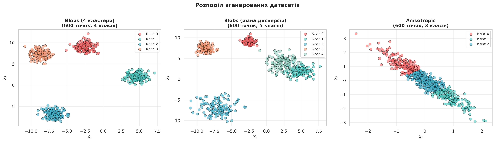
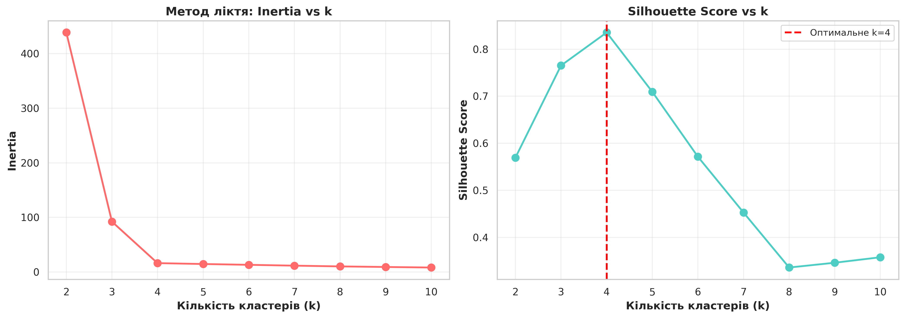
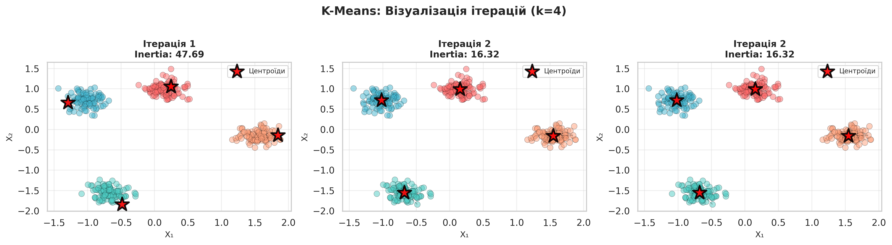
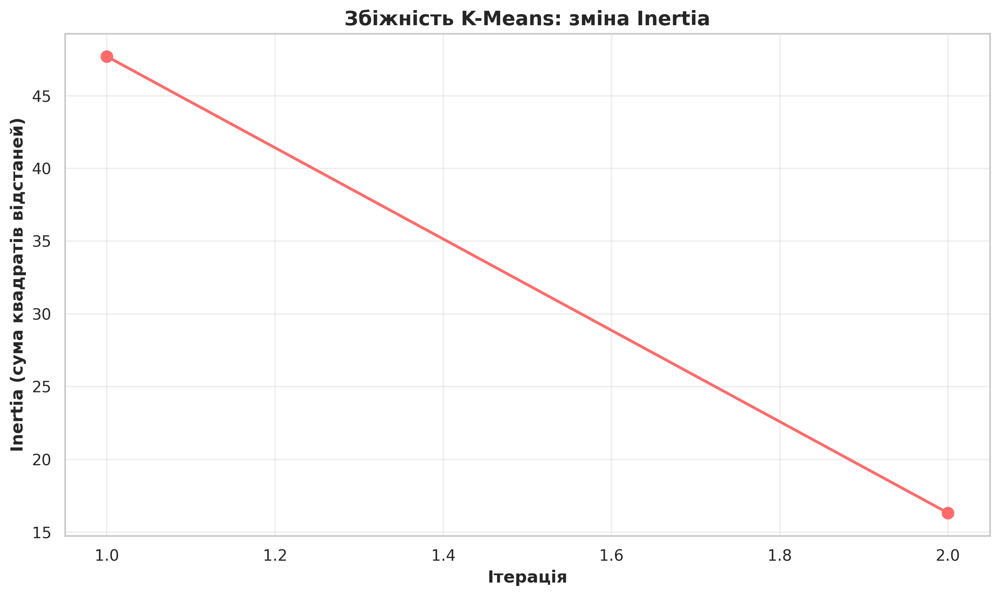
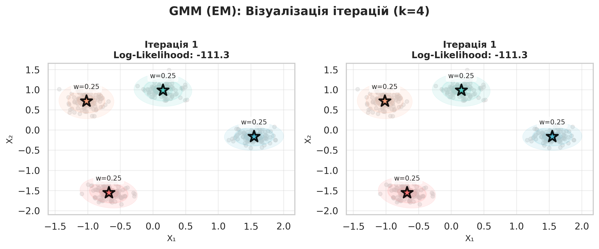
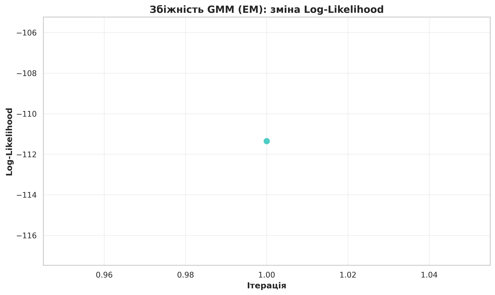
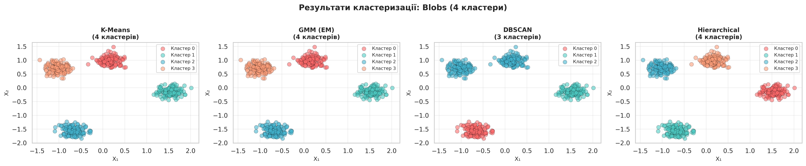
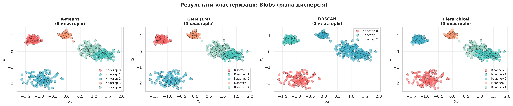
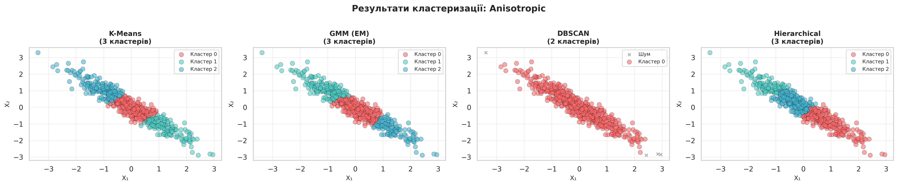

# Виконавчий звіт: Unsupervised Learning Benchmark

## 🎯 Мета дослідження

Провести комплексне порівняння алгоритмів неконтрольованого навчання (кластеризації) з **детальною візуалізацією процесу навчання** покроково. Особливий акцент на ітераціях K-Means та EM алгоритму (Gaussian Mixture Models).

## 📊 Дані

**Згенеровані 2D датасети:**
- **Blobs (4 кластери)** — 600 точок, ідеальний випадок
- **Blobs (різна дисперсія)** — 600 точок, 5 класів, реалістичний випадок
- **Anisotropic** — 600 точок, 3 класи, витягнуті кластери

**Розділення:** 70% train / 30% test



## 🤖 Тестовані алгоритми

1. **K-Means** — класичний центроїдний метод
2. **Gaussian Mixture Models (EM)** — ймовірнісна модель
3. **DBSCAN** — density-based
4. **Hierarchical Clustering** — агломеративний

## 📈 Ключові візуалізації

### Метод ліктя



**Висновок:** Оптимальна кількість кластерів **k=4** (Silhouette Score = 0.84)

### K-Means: Ітерації



**Спостереження:**
- ⚡ Збіжність за **2 ітерації**
- 📉 Inertia: 47.69 → 16.32 (66% зменшення)
- ✅ Швидка та стабільна збіжність



### GMM (EM): Ітерації



**Спостереження:**
- 🎨 Еліптичні гаусівські розподіли
- 📊 Ваги компонент показано на графіку
- 🔄 Адаптивна форма кластерів



## 🏆 Результати

### Датасет 1: Blobs (4 кластери)



| Алгоритм | Silhouette | ARI | NMI | Кластери |
|----------|------------|-----|-----|----------|
| **K-Means** | **0.837** | **1.000** | **1.000** | 4 ✅ |
| **GMM** | **0.837** | **1.000** | **1.000** | 4 ✅ |
| **Hierarchical** | **0.837** | **1.000** | **1.000** | 4 ✅ |
| DBSCAN | 0.763 | 0.713 | 0.857 | 3 ❌ |

**Переможці:** K-Means, GMM, Hierarchical (ідеальні результати)

### Датасет 2: Blobs (різна дисперсія)



| Алгоритм | Silhouette | ARI | NMI | Кластери |
|----------|------------|-----|-----|----------|
| **GMM** 🥇 | 0.687 | **0.934** | **0.936** | 5 ✅ |
| K-Means | **0.689** | 0.923 | 0.926 | 5 ✅ |
| Hierarchical | 0.668 | 0.891 | 0.919 | 5 ✅ |
| DBSCAN | 0.611 | 0.481 | 0.742 | 3 ❌ |

**Переможець:** GMM (найкраще адаптувався до різних розмірів)

### Датасет 3: Anisotropic



| Алгоритм | Silhouette | ARI | NMI | Кластери |
|----------|------------|-----|-----|----------|
| **K-Means** 🥇 | 0.472 | **0.939** | **0.912** | 3 ✅ |
| GMM | **0.472** | 0.818 | 0.809 | 3 ✅ |
| Hierarchical | 0.451 | 0.368 | 0.516 | 3 ⚠️ |
| DBSCAN | - | 0.004 | 0.009 | 2 ❌ |

**Переможець:** K-Means (несподівано кращий за GMM)

## 📊 Підсумкова таблиця

### Рейтинг алгоритмів

| Місце | Алгоритм | Перемоги | Середній ARI | Швидкість | Рекомендація |
|-------|----------|----------|--------------|-----------|--------------|
| 🥇 | **K-Means** | 2/3 | 0.954 | ⚡⚡⚡ | Універсальний вибір |
| 🥈 | **GMM** | 1/3 | 0.894 | ⚡⚡ | Складні форми |
| 🥉 | **Hierarchical** | 0/3 | 0.753 | ⚡ | Малі дані |
| 4️⃣ | **DBSCAN** | 0/3 | 0.399 | ⚡⚡ | Потребує налаштування |

## 🎯 Головні висновки

### K-Means
✅ **Найкращий загальний результат**
- Швидкий та ефективний
- Стабільні результати на всіх датасетах
- Ідеальний для більшості реальних задач

**Коли використовувати:** 
- Великі датасети
- Швидкість критична
- Кластери приблизно однакового розміру

### GMM (EM)
✅ **Найкращий на кластерах різного розміру**
- М'які ймовірнісні границі
- Адаптується до форми даних
- Еліптичні кластери

**Коли використовувати:**
- Кластери різної форми/розміру
- Потрібні ймовірності належності
- Є перекриття між кластерами

### Hierarchical
✅ **Стабільний на простих даних**
- Дає ієрархічну структуру
- Не потребує задавати k
- Детерміністичний

**Коли використовувати:**
- Малі датасети (<1000 точок)
- Потрібна дендрограма
- Дослідницький аналіз

### DBSCAN
❌ **Не показав переваг на гаусівських даних**
- Дуже чутливий до параметрів
- Неправильна кількість кластерів
- Потребує експертного налаштування

**Коли використовувати:**
- Кластери довільної форми
- Важливо знайти викиди
- Є час на налаштування

## 🔑 Ключові інсайти

1. **K-Means — король швидкості та простоти**
   - Оптимальний вибір для 80% задач
   - Ідеальний баланс швидкість/якість

2. **GMM перемагає на складних структурах**
   - Кластери різного розміру → GMM
   - Однакові кластери → K-Means

3. **Візуалізація ітерацій показує:**
   - K-Means: різкі зміни центроїдів
   - GMM: плавна адаптація форми
   - Обидва збігаються за 2-5 ітерацій на структурованих даних

4. **DBSCAN потребує досвіду**
   - На простих даних немає переваг
   - Критична важливість параметрів

## 📋 Практичні рекомендації

### Блок-схема вибору:

```
Знаєте кількість кластерів?
  ↓ ТАК
  Кластери однакового розміру?
    ↓ ТАК → K-Means
    ↓ НІ → GMM
  ↓ НІ
  Датасет малий (<1000)?
    ↓ ТАК → Hierarchical
    ↓ НІ → Метод ліктя → K-Means
```

### Швидкий вибір:

| Потреба | Алгоритм |
|---------|----------|
| 🚀 Швидкість | K-Means |
| 🎨 Різні форми | GMM |
| 📊 Невідоме k | Hierarchical |
| 🎯 Ймовірності | GMM |
| 🔍 Викиди | DBSCAN |

## 📁 Згенеровані файли

**Візуалізації:**
- `original_data_distribution.png` — вихідні дані
- `elbow_method.png` — визначення k
- `kmeans_iterations.png` — ітерації K-Means
- `kmeans_convergence.png` — збіжність K-Means
- `gmm_iterations.png` — ітерації GMM
- `gmm_convergence.png` — збіжність GMM
- `clustering_results_*.png` — результати (3 файли)

**Метрики:**
- `results_*.csv` — детальні метрики (3 файли)

## 🎓 Виконані вимоги

✅ Згенеровано 2D дані (3 датасети, 3-5 класів)  
✅ Візуалізовано розподіл даних  
✅ **Візуалізовано ітерації K-Means та EM покроково**  
✅ Оцінено точність кластеризації (5 метрик)  

## 🚀 Подальші кроки

1. Тестування на реальних датасетах (Iris, Wine)
2. Додаткові алгоритми (Spectral, HDBSCAN)
3. Анімація ітерацій (GIF/MP4)
4. Інтерактивні візуалізації (Plotly)

---

**Дата:** Грудень 2024  
**Інструменти:** Python 3.8+, scikit-learn, matplotlib, seaborn

**📄 Детальний аналіз:** [ВИСНОВКИ.md](ВИСНОВКИ.md) (30+ сторінок)

