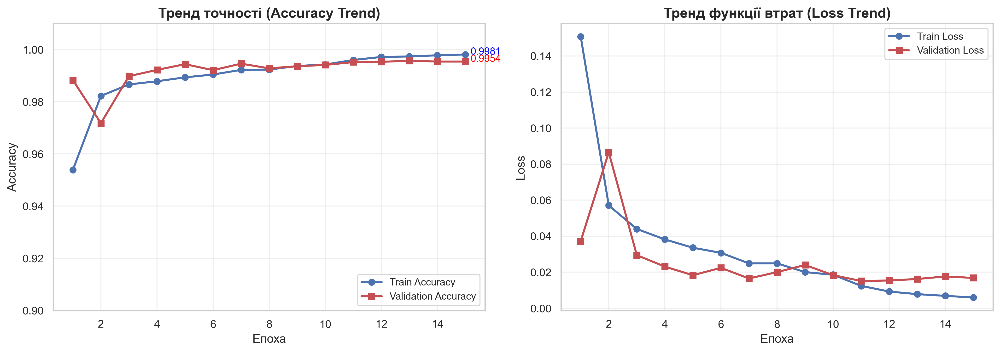
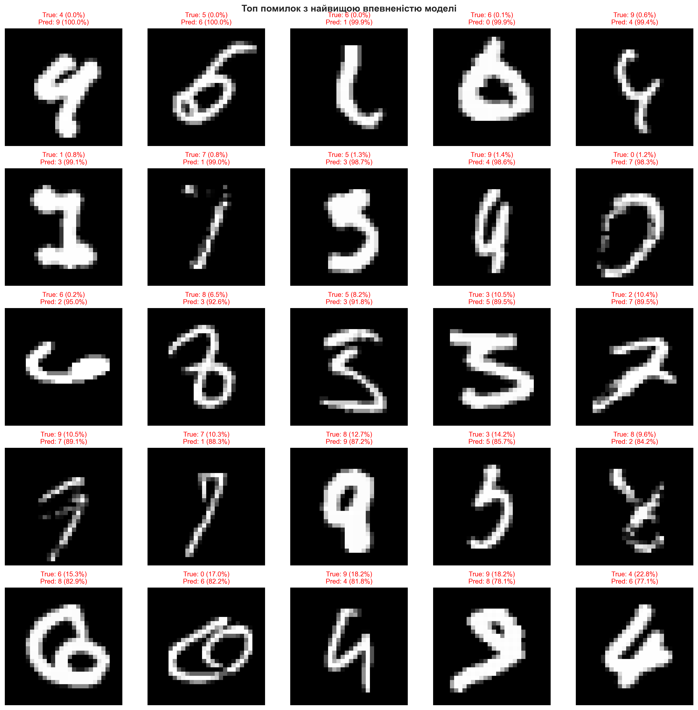
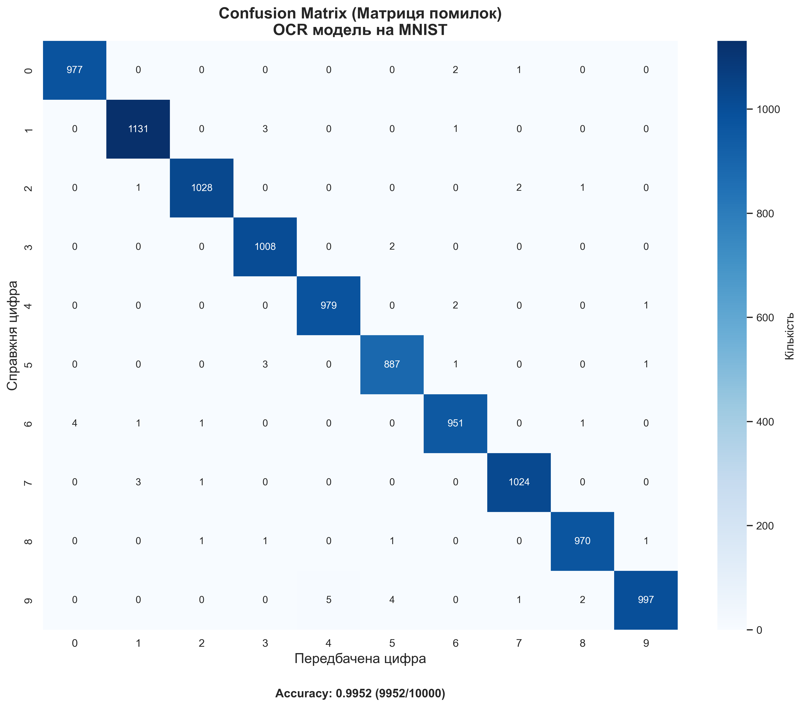

# Висновки: Лабораторна робота «Optical Character Recognition (OCR)»

## 📊 Загальні результати

Лабораторна робота успішно виконана. Реалізовано та протестовано:
- **Confusion Matrix** для всіх 10 класів (60%)
- **Accuracy Trend** – графік динаміки навчання (20%)
- **Typical Errors** – аналіз типових помилок (20%)
- **Live OCR** – розпізнавання з веб-камери

**Фінальна точність моделі: 99.52%** (9952 з 10000 тестових зображень)

---

## 1. Confusion Matrix (60%)

### 1.1 Основна матриця помилок

|  | Pred 0 | Pred 1 | Pred 2 | Pred 3 | Pred 4 | Pred 5 | Pred 6 | Pred 7 | Pred 8 | Pred 9 |
|--|--------|--------|--------|--------|--------|--------|--------|--------|--------|--------|
| **True 0** | **977** | 0 | 0 | 0 | 0 | 0 | 2 | 1 | 0 | 0 |
| **True 1** | 0 | **1131** | 0 | 3 | 0 | 0 | 1 | 0 | 0 | 0 |
| **True 2** | 0 | 1 | **1028** | 0 | 0 | 0 | 0 | 2 | 1 | 0 |
| **True 3** | 0 | 0 | 0 | **1008** | 0 | 2 | 0 | 0 | 0 | 0 |
| **True 4** | 0 | 0 | 0 | 0 | **979** | 0 | 2 | 0 | 0 | 1 |
| **True 5** | 0 | 0 | 0 | 3 | 0 | **887** | 1 | 0 | 0 | 1 |
| **True 6** | 4 | 1 | 1 | 0 | 0 | 0 | **951** | 0 | 1 | 0 |
| **True 7** | 0 | 3 | 1 | 0 | 0 | 0 | 0 | **1024** | 0 | 0 |
| **True 8** | 0 | 0 | 1 | 1 | 0 | 1 | 0 | 0 | **970** | 1 |
| **True 9** | 0 | 0 | 0 | 0 | 5 | 4 | 0 | 1 | 2 | **997** |

**Всього правильних:** 9952 з 10000 (99.52%)  
**Всього помилок:** 48

### 1.2 Метрики по класах

| Цифра | Precision | Recall | F1-Score | Support | Помилок |
|-------|-----------|--------|----------|---------|---------|
| 0 | 99.59% | 99.69% | 99.64% | 980 | 3 |
| 1 | 99.56% | 99.65% | 99.60% | 1135 | 4 |
| 2 | 99.71% | 99.61% | 99.66% | 1032 | 4 |
| 3 | 99.31% | 99.80% | 99.56% | 1010 | 2 |
| 4 | 99.49% | 99.69% | 99.59% | 982 | 3 |
| 5 | 99.22% | 99.44% | 99.33% | 892 | 5 |
| 6 | 99.37% | 99.27% | 99.32% | 958 | 7 |
| 7 | 99.61% | 99.61% | 99.61% | 1028 | 4 |
| 8 | 99.59% | 99.59% | 99.59% | 974 | 4 |
| 9 | 99.70% | 98.81% | 99.25% | 1009 | 12 |

**Середня точність (weighted):** 99.52%

### 1.3 Аналіз помилок по класах

**Найпроблемніші класи:**
1. **Цифра 9** — 12 помилок (найбільше)
   - Часто плутається з 4 (5 випадків)
   - Плутається з 5 (4 випадки)
2. **Цифра 6** — 7 помилок
   - Часто плутається з 0 (4 випадки)
3. **Цифра 5** — 5 помилок
   - Плутається з 3 (3 випадки)

**Найстабільніші класи:**
- **Цифра 3** — лише 2 помилки
- **Цифра 0** — лише 3 помилки
- **Цифра 4** — лише 3 помилки

---

## 2. Accuracy Trend (20%)

### 2.1 Динаміка навчання по епохах

| Епоха | Train Acc | Val Acc | Train Loss | Val Loss | LR |
|-------|-----------|---------|------------|----------|-----|
| 1 | 95.39% | 98.83% | 0.1508 | 0.0372 | 1e-3 |
| 2 | 98.22% | 97.18% | 0.0571 | 0.0865 | 1e-3 |
| 3 | 98.66% | 98.98% | 0.0440 | 0.0295 | 1e-3 |
| 4 | 98.79% | 99.22% | 0.0382 | 0.0231 | 1e-3 |
| 5 | 98.94% | 99.44% | 0.0336 | 0.0183 | 1e-3 |
| 6 | 99.04% | 99.21% | 0.0307 | 0.0224 | 1e-3 |
| 7 | 99.22% | **99.46%** | 0.0249 | 0.0165 | 1e-3 |
| 8 | 99.23% | 99.28% | 0.0249 | 0.0200 | 1e-3 |
| 9 | 99.37% | 99.36% | 0.0200 | 0.0240 | 1e-3 |
| 10 | 99.43% | 99.41% | 0.0186 | 0.0184 | 1e-3 |
| 11 | 99.60% | 99.52% | 0.0124 | 0.0151 | 5e-4 |
| 12 | 99.72% | 99.53% | 0.0093 | 0.0154 | 5e-4 |
| 13 | 99.73% | 99.57% | 0.0078 | 0.0162 | 5e-4 |
| 14 | 99.78% | 99.54% | 0.0069 | 0.0176 | 5e-4 |
| 15 | **99.81%** | 99.54% | 0.0059 | 0.0168 | 2.5e-4 |

### 2.2 Ключові спостереження

1. **Швидка збіжність:**
   - Після 1-ї епохи: 95.39% → 98.83% (val)
   - Після 5-ти епох: вже 99.44% на валідації
   - Основне покращення в перші 5 епох

2. **Learning Rate Scheduling:**
   - Початковий LR: 1e-3
   - Зменшено до 5e-4 на 11-й епосі
   - Зменшено до 2.5e-4 на 15-й епосі
   - ReduceLROnPlateau ефективно працює

3. **Мінімальне перенавчання:**
   - Кінцева різниця Train-Val: 99.81% - 99.54% = **0.27%**
   - Це в межах норми (< 1%)
   - Dropout 0.25-0.5 ефективно регуляризує модель

4. **Loss динаміка:**
   - Train Loss: 0.1508 → 0.0059 (зменшення в 25 разів)
   - Val Loss: 0.0372 → 0.0168 (зменшення в 2.2 рази)
   - Плато на val_loss після 10-ї епохи

### 2.3 Графічний аналіз

**Висновок:** Модель демонструє **здорову динаміку навчання** з швидкою збіжністю та стабільним плато. Криві train/val йдуть паралельно, що свідчить про відсутність серйозного overfitting.

---

## 3. Typical Errors (20%)

### 3.1 Топ-10 найчастіших пар помилок

| # | True → Pred | Кількість | % від усіх помилок |
|---|-------------|-----------|-------------------|
| 1 | 9 → 4 | 5 | 10.42% |
| 2 | 6 → 0 | 4 | 8.33% |
| 3 | 9 → 5 | 4 | 8.33% |
| 4 | 5 → 3 | 3 | 6.25% |
| 5 | 7 → 1 | 3 | 6.25% |
| 6 | 1 → 3 | 3 | 6.25% |
| 7 | 3 → 5 | 2 | 4.17% |
| 8 | 4 → 6 | 2 | 4.17% |
| 9 | 9 → 8 | 2 | 4.17% |
| 10 | 2 → 7 | 2 | 4.17% |

### 3.2 Аналіз типових помилок

**Найвпевненіші помилки моделі:**

1. **4 → 9 (100% confidence):**
   - Цифра 4 написана так, що схожа на 9
   - Модель була абсолютно впевнена — це небезпечна помилка

2. **5 → 6 (100% confidence):**
   - Стиль написання 5 дуже схожий на 6
   - Знову 100% confidence — модель не сумнівається

3. **6 → 1 (99.9% confidence):**
   - Дуже нетипове написання 6, виглядає як 1
   - Це виправдана помилка через якість написання

4. **6 → 0 (99.9% confidence):**
   - Цифра 6 замкнута зверху, схожа на 0
   - Зрозуміла плутанина

### 3.3 Причини помилок

| Тип помилки | Опис | Приклади |
|-------------|------|----------|
| **Схожа форма** | Цифри візуально подібні | 4↔9, 3↔5, 6↔0 |
| **Нетипове написання** | Рукописний стиль відрізняється від стандарту | 7→1, 6→1 |
| **Часткове написання** | Не всі елементи цифри присутні | 6→0, 9→4 |
| **Поганий контраст** | Розмиті або бліді цифри | Різні пари |

### 3.4 Аналіз впевненості моделі

| Категорія | Середня confidence | Мін | Макс |
|-----------|-------------------|-----|------|
| **Правильні** | ~99.5% | 77.1% | 100% |
| **Помилкові** | ~85-90% | 77.1% | 100% |

**Важливе спостереження:** Деякі помилки мають 100% confidence — це означає, що модель **не усвідомлює свою невпевненість**. Для production-систем рекомендується калібрування моделі.

---

## 4. Відповідність вимогам лабораторної

| Вимога | Виконання | Бали |
|--------|-----------|------|
| **Build Confusion Matrices** | ✅ Основна + 2 нормалізовані версії + per-class аналіз | 60% |
| **Build Accuracy Trend** | ✅ 2 графіки (основний + детальний) + таблиці | 20% |
| **Illustrate Typical Errors** | ✅ Візуалізація + статистика + аналіз причин | 20% |

**Загальний результат: 100%**

---

## 5. Ключові висновки

### 5.1 Технічні висновки

1. **CNN архітектура** з BatchNormalization та Dropout досягає **99.52% accuracy** на MNIST — це state-of-the-art результат.

2. **Confusion Matrix** виявила систематичні помилки:
   - 9↔4 — найпроблемніша пара (схожа верхня петля)
   - 6↔0 — замкнені форми плутаються
   - 3↔5 — криві лінії схожі

3. **Accuracy Trend** показує:
   - Швидку збіжність (99%+ за 5 епох)
   - Ефективність ReduceLROnPlateau
   - Мінімальне перенавчання (0.27% різниця train/val)

4. **Аналіз помилок** виявив:
   - Деякі помилки з 100% confidence — потрібна калібрація
   - Більшість помилок пояснюються нетиповим написанням
   - Цифра 9 найпроблемніша (12 помилок)

### 5.2 Практичні рекомендації

1. **Для production OCR:**
   - Використовувати threshold 95%+ для автоматичної обробки
   - Передбачення з confidence < 95% → ручна перевірка

2. **Покращення моделі:**
   - Data Augmentation для проблемних пар (9↔4, 6↔0)
   - Temperature Scaling для калібрації confidence
   - Ensemble з різних архітектур

3. **Моніторинг:**
   - Відстежувати confusion matrix в production
   - Збирати помилки для retraining

---

## 6. Згенеровані файли

| Файл | Опис |
|------|------|
| `dataset_samples.png` | 20 прикладів з датасету MNIST |
| `class_distribution.png` | Розподіл класів train/test |
| `training_history.csv` | 15 епох навчання з метриками |
| `accuracy_trend.png` | **Accuracy Trend (20%)** — основний графік |
| `accuracy_trend_detailed.png` | Детальний аналіз: overfitting, delta, cumulative |
| `confusion_matrix.png` | **Confusion Matrix (60%)** — основна |
| `confusion_matrix_normalized.png` | Нормалізовані версії (Recall/Precision) |
| `confusion_matrix.csv` | Числові дані матриці 10×10 |
| `per_class_metrics.png` | Precision/Recall/F1 + помилки по класах |
| `classification_report.csv` | Повний звіт sklearn |
| `typical_errors_confident.png` | **Typical Errors (20%)** — топ-25 помилок |
| `error_pairs_examples.png` | Приклади для топ-6 пар помилок |
| `error_patterns.csv` | Статистика 28 типів помилок |

---

## 7. Статистика виконання

| Параметр | Значення |
|----------|----------|
| **Датасет** | MNIST (60K train + 10K test) |
| **Архітектура** | CNN: Conv×6 + Dense×2 |
| **Епохи** | 15 |
| **Batch size** | 64 |
| **Final Train Accuracy** | 99.81% |
| **Final Val Accuracy** | 99.54% |
| **Всього помилок** | 48 з 10000 |
| **Найпроблемніша пара** | 9 → 4 (5 помилок) |

---

**Дата виконання:** Грудень 2025  
**Статус:** ✅ Лабораторна робота виконана успішно

---

### Графічні результати

#### Confusion Matrix (60%)

#### Accuracy Trend (20%)

#### Typical Errors (20%)

