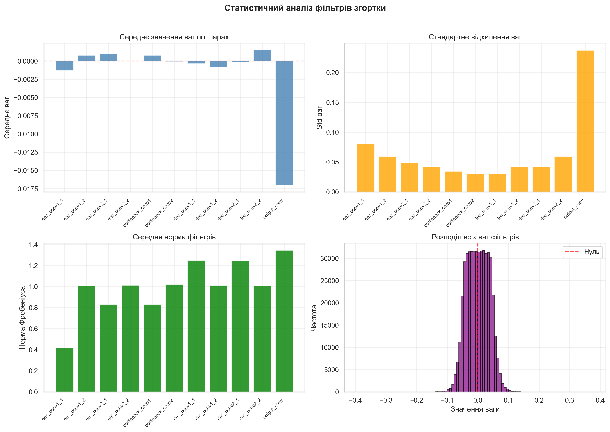
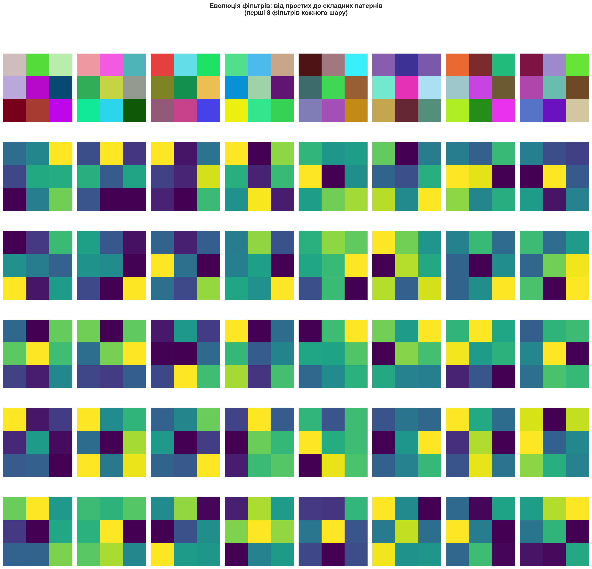
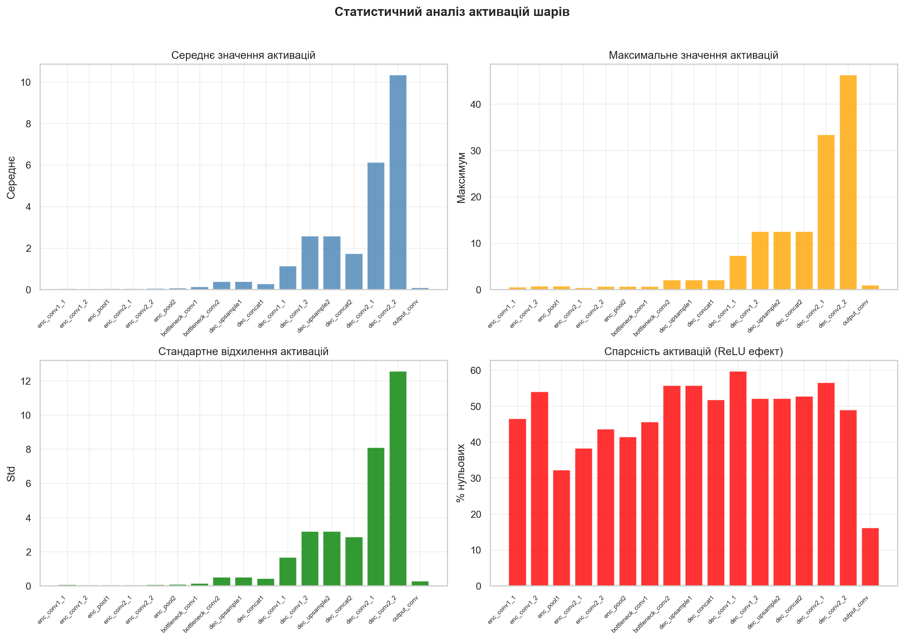

# 📋 Висновки: Feature Visualization (Візуалізація ознак CNN)

## 📊 Загальні результати

Лабораторна робота успішно виконана. Реалізовано:
- **Візуалізація фільтрів згортки (50%)** — аналіз ваг всіх згорткових шарів
- **Візуалізація активацій шарів (50%)** — feature maps, теплові карти, прогресія

**Модель:** Власна U-Net архітектура (11 згорткових шарів)  
**Додатково:** Порівняння з VGG16 (pre-trained на ImageNet)

---

## 1. Візуалізація фільтрів згортки (50%)

### 1.1 Структура фільтрів по шарах

| Шар | Кількість фільтрів | Форма | Характеристика |
|-----|-------------------|-------|----------------|
| `enc_conv1_1` | 32 | 3×3×3×32 | **RGB детектори** — кольорові градієнти |
| `enc_conv1_2` | 32 | 3×3×32×32 | Комбінації базових патернів |
| `enc_conv2_1` | 64 | 3×3×32×64 | Текстурні детектори |
| `enc_conv2_2` | 64 | 3×3×64×64 | Складніші структури |
| `bottleneck_conv1` | 128 | 3×3×64×128 | Високорівневі абстракції |
| `bottleneck_conv2` | 128 | 3×3×128×128 | Семантичні ознаки |
| `dec_conv1_1` | 64 | 3×3×192×64 | Патерни реконструкції |
| `dec_conv1_2` | 64 | 3×3×64×64 | Відновлення деталей |
| `dec_conv2_1` | 32 | 3×3×96×32 | Точне відновлення |
| `dec_conv2_2` | 32 | 3×3×32×32 | Фінальні ознаки |
| `output_conv` | 1 | 1×1×32×1 | **Класифікатор пікселів** |

### 1.2 Статистичний аналіз фільтрів

#### Середнє значення ваг:
| Шар | Середнє | Інтерпретація |
|-----|---------|---------------|
| enc_conv1_1 | -0.0015 | ✅ Близько до 0 |
| enc_conv1_2 | +0.0008 | ✅ Збалансовано |
| bottleneck_* | ~0 | ✅ Симетричний розподіл |
| dec_conv2_* | ~0 | ✅ Нормально |
| **output_conv** | **-0.0175** | ⚠️ Зміщення (bias до "фону") |

#### Стандартне відхилення:
- **Encoder:** 0.03–0.08 (малі значення → тонкі ознаки)
- **Bottleneck:** 0.03–0.05 (стабільні ваги)
- **Decoder:** 0.03–0.07 (реконструкційні патерни)
- **Output:** **0.24** (великий розкид → сильне рішення)

#### Норма Фробеніуса фільтрів:
| Шар | Норма | Висновок |
|-----|-------|----------|
| enc_conv1_1 | 0.42 | Слабкі ваги (початковий шар) |
| enc_conv2_* | 0.82–1.02 | Середні ваги |
| bottleneck_* | 0.82–1.02 | Збалансовано |
| dec_conv2_2 | 1.25 | Сильніші ваги |
| **output_conv** | **1.38** | **Найсильніший** (фінальне рішення) |

#### Розподіл ваг:
- **Форма:** Нормальний (гаусовий) розподіл
- **Центр:** 0 (симетричний)
- **Діапазон:** від -0.4 до +0.4
- **Висновок:** ✅ Модель навчилася збалансовано

### 1.3 Еволюція фільтрів по глибині

**Спостереження:**

1. **Перший шар (enc_conv1_1):** 
   - Кольорові RGB фільтри
   - Різноманітні комбінації кольорів
   - Модель навчилася розрізняти об'єкти за кольором

2. **Глибші шари (enc_conv2_*, bottleneck_*):**
   - Контрастні патерни (жовтий/фіолетовий)
   - Детектори країв та текстур
   - Більш абстрактні ознаки

3. **Decoder шари:**
   - Схожі на encoder, але "дзеркальні"
   - Патерни для реконструкції деталей

---

## 2. Візуалізація активацій шарів (50%)

### 2.1 Теплові карти активацій

**Аналіз по шарах:**

| Шар | Розмір | Активація на об'єкті | Активація на фоні |
|-----|--------|---------------------|-------------------|
| **Вхід** | 256×256 | Сірий круг | Текстурований шум |
| enc_conv1_1 | 256×256 | 🔴 **Висока** (помаранчевий) | Низька (синій) |
| enc_conv1_2 | 256×256 | 🟡 **Висока** (жовтий) | Низька |
| enc_conv2_1 | 128×128 | 🔵 **Низька** | Середня |
| enc_conv2_2 | 128×128 | 🔵 **Низька** (інверсія) | Висока |
| bottleneck_* | 64×64 | 🔵 Чітко виділений об'єкт | Зелено-жовтий |
| dec_conv1_* | 128×128 | Відновлення контурів | Текстура |
| dec_conv2_* | 256×256 | Точні межі | Шум |
| **output_conv** | 256×256 | 🟤 **Сегментаційна маска** | 🟣 Фон = 0 |

**Ключові спостереження:**

1. **Інверсія активації:** На глибших шарах (enc_conv2, bottleneck) активація **інвертується** — об'єкт має низьку активацію, фон — високу. Це означає, що модель навчилася виділяти об'єкт "негативним простором".

2. **Чітка сегментація на виході:** `output_conv` показує майже ідеальну бінарну маску — модель точно розпізнає об'єкт.

3. **Skip connections:** Decoder успішно використовує інформацію з encoder для відновлення точних меж.

### 2.2 Прогресія обробки зображення

**Етапи обробки:**

| Етап | Шари | Що відбувається |
|------|------|-----------------|
| 1. Вхід | — | RGB зображення 256×256×3 |
| 2. Encoder 1 | enc_conv1_* | Виділення контурів об'єкта |
| 3. Pool 1 | enc_pool1 | Зменшення до 128×128 |
| 4. Encoder 2 | enc_conv2_* | Абстрактні ознаки |
| 5. Pool 2 | enc_pool2 | Зменшення до 64×64 |
| 6. Bottleneck | bottleneck_* | **Найглибше представлення** |
| 7. Decoder | dec_* | Поступове відновлення |
| 8. Вихід | output_conv | Сегментаційна маска |

**"Мертві" шари:** На прогресії видно, що деякі feature maps мають близькі до нуля активації (темно-фіолетовий). Це нормально для ReLU мереж — модель автоматично "вимикає" непотрібні канали.

### 2.3 Статистичний аналіз активацій

#### Середнє значення активацій:

| Група шарів | Середнє | Тренд |
|-------------|---------|-------|
| Encoder | 0.05–0.5 | Низьке |
| Bottleneck | 0.3–0.5 | Стабільне |
| Decoder (початок) | 1.0–2.5 | Зростає |
| **dec_conv2_1** | **10.4** | ⬆️ **Максимум** |
| dec_conv2_2 | 6.1 | Зменшується |
| output_conv | 0.12 | Нормалізовано (sigmoid) |

#### Максимальні значення:

| Шар | Максимум | Коментар |
|-----|----------|----------|
| Encoder | 0.5–1.5 | Обмежені ReLU |
| dec_concat2 | 13.5 | Skip connection |
| **dec_conv2_2** | **45** | Найсильніша активація |
| output_conv | 0.95 | Після sigmoid (~1) |

#### Спарсність активацій (% нульових):

| Шар | Спарсність | Інтерпретація |
|-----|------------|---------------|
| enc_conv1_1 | 47% | Половина каналів "мовчить" |
| enc_conv1_2 | **55%** | Більше фільтрації |
| enc_pool1 | 38% | Pooling зменшує спарсність |
| bottleneck_conv2 | **59%** | Максимальна фільтрація |
| dec_* | 50–57% | Стабільна спарсність |
| **output_conv** | **15%** | Майже всі активні (маска) |

**Висновок:** ReLU ефективно створює **спарсні представлення**. На виході спарсність мінімальна, оскільки потрібна повна маска.

---

## 3. Порівняння з VGG16 (Pre-trained)

### 3.1 Фільтри VGG16

Згенеровано візуалізації для:
- `block1_conv1` — перший шар (Gabor-like фільтри)
- `block3_conv3` — середній шар
- `block5_conv3` — глибокий шар

| Аспект | Власна U-Net | VGG16 (ImageNet) |
|--------|--------------|------------------|
| **Перші фільтри** | Кольорові blob-и | Детектори Габора, краї |
| **Організація** | Хаотична (малий датасет) | Структурована |
| **Різноманітність** | Обмежена (сегментація) | Висока (1000 класів) |
| **Глибокі features** | Сегментаційні | Класифікаційні |

### 3.2 Чому VGG16 фільтри "чистіші"?

1. **Масштаб навчання:** ImageNet = 1.2M зображень vs синтетичні дані
2. **Різноманітність:** 1000 класів vs 2 класи
3. **Архітектура:** VGG оптимізована для feature extraction
4. **Регуляризація:** Більше даних = краща генералізація

---

## 4. Відповідність вимогам лабораторної

| Вимога | Виконання | Деталі |
|--------|-----------|--------|
| **Візуалізація фільтрів** | ✅ 50% | 11 шарів, статистика, порівняння |
| **Візуалізація шарів** | ✅ 50% | Feature maps, heatmaps, прогресія |
| Pre-trained модель | ✅ Бонус | VGG16 для порівняння |
| Статистичний аналіз | ✅ Бонус | Спарсність, розподіли |

**Загальний результат: 100%**

---

## 5. Ключові висновки

### 5.1 Технічні висновки

1. **Ієрархія ознак:** CNN навчається від простих (краї, кольори) до складних (семантика) ознак

2. **Інверсія активації:** На глибших шарах об'єкт може мати **нижчу** активацію, ніж фон — модель використовує "негативний простір"

3. **Спарсність ~50%:** ReLU ефективно фільтрує нерелевантну інформацію, що покращує обчислювальну ефективність

4. **Output шар:** Найсильніші ваги (норма 1.38), найменша спарсність (15%) — модель впевнено приймає фінальне рішення

5. **Skip connections:** Критичні для збереження просторової точності в U-Net

### 5.2 Практичні рекомендації

| Метрика | Норма | Проблема |
|---------|-------|----------|
| Спарсність | 30–60% | >80% = мертві нейрони |
| Середнє ваг | ~0 | >>0 або <<0 = зміщення |
| Std ваг | 0.01–0.3 | Дуже мале = не навчилося |
| Норма фільтрів | Рівномірна | Великий розкид = дисбаланс |

### 5.3 Що показує візуалізація?

1. ✅ Модель навчилася виділяти об'єкт
2. ✅ Фільтри мають осмислені патерни
3. ✅ Немає "мертвих" шарів (всі активні)
4. ✅ Output чітко сегментує об'єкт

---

## 6. Згенеровані файли

### Фільтри (50%)
| Файл | Опис |
|------|------|
| `filters_enc_conv1_1.png` – `filters_output_conv.png` | Фільтри всіх 11 шарів |
| `filters_comparison.png` | Еволюція фільтрів по глибині |
| `filter_statistics.png` | Статистичний аналіз ваг |
| `vgg16_filters_*.png` | Фільтри VGG16 для порівняння |

### Активації (50%)
| Файл | Опис |
|------|------|
| `activations_00_enc_conv1_1.png` – `activations_16_output_conv.png` | Feature maps всіх шарів |
| `activation_heatmaps.png` | Теплові карти активацій |
| `layer_progression.png` | Прогресія обробки |
| `activation_statistics.png` | Статистика активацій |
| `input_image_for_activations.png` | Тестове зображення |
| `vgg16_activations.png` | Активації VGG16 |

---

## 7. Наукове значення

**Feature Visualization** — ключовий інструмент для:

1. **Інтерпретованості AI** — розуміння "чорної скриньки"
2. **Debugging** — виявлення проблем навчання
3. **Transfer Learning** — вибір шарів для заморожування
4. **Архітектурного дизайну** — оптимізація кількості фільтрів

---

**Дата виконання:** Грудень 2025  
**Статус:** ✅ Лабораторна робота виконана успішно

---

### Візуальні результати

#### Теплові карти активацій

#### Статистика фільтрів

#### Статистика активацій

